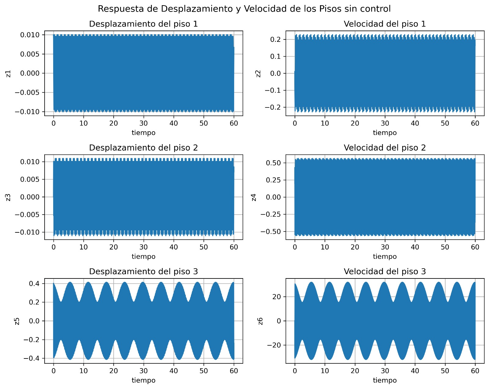
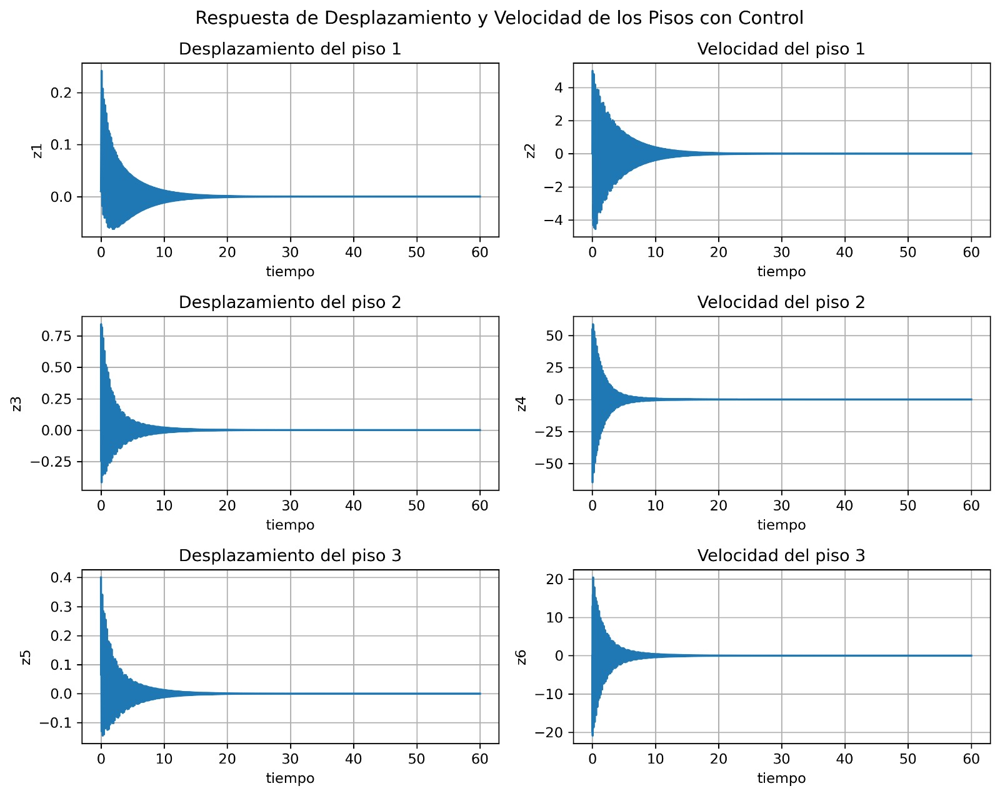
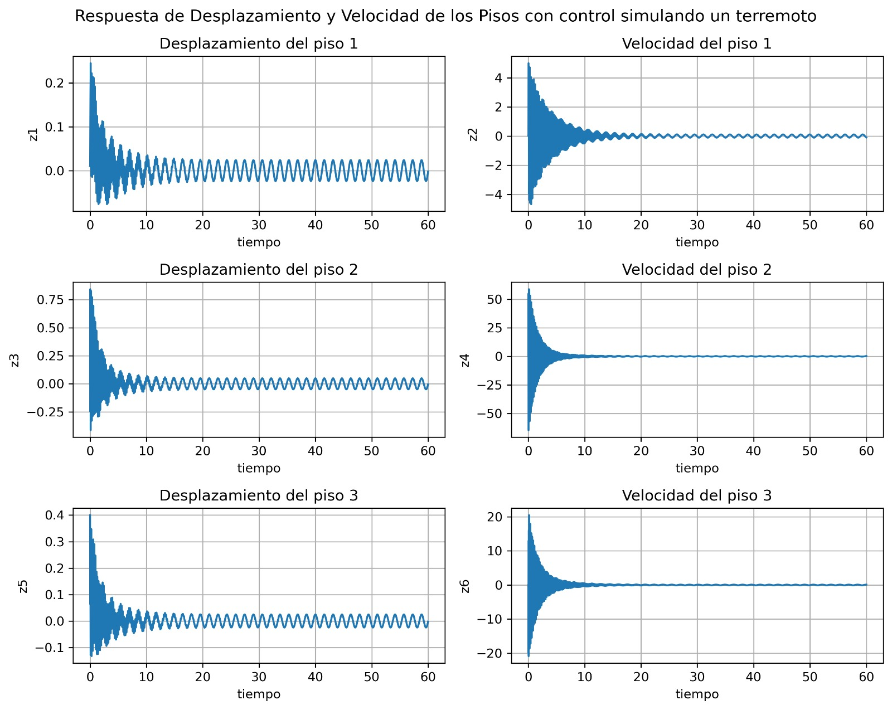
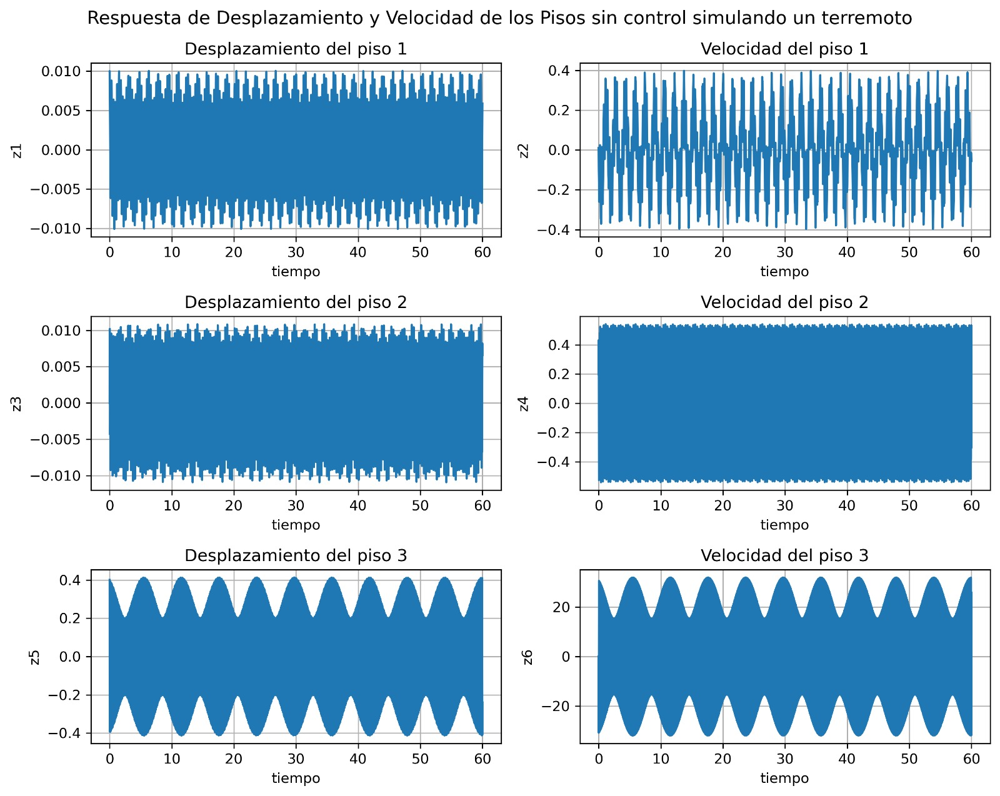

# Diseño e Implementación de Sistemas de Control para Mitigar Vibraciones Resonantes en Edificaciones Durante Eventos Sísmicos

Este estudio se centra en la ingeniería estructural y el control de sistemas dinámicos, con el objetivo de diseñar e implementar
 un sistema de control para mitigar los efectos destructivos de los terremotos en edificaciones. La investigación abarca aspectos teóricos
 clave como las vibraciones resonantes, el modelado de sistemas mecánicos bajo cargas sísmicas, y los principios de control de vibra
ciones. Se presenta un modelo de edificio de múltiples pisos como un sistema masa-resorte-amortiguador y se desarrollan las ecuaciones
 diferenciales que describen su comportamiento dinámico. Además, se exploran diversas estrategias de control, incluidos los controladores
 PID y de estado, para reducir las amplitudes de vibración y mejorar la estabilidad estructural. A través del análisis de un edificio de tres
 pisos, se demuestra la efectividad de los controladores en mantener las respuestas estructurales dentro de límites seguros durante eventos
 sísmicos. La dinámica del sistema se modela y se analiza tanto en condiciones de lazo abierto como con control aplicado, mostrando que
 la implementación de controladores puede mitigar significativamente los efectos adversos de las vibraciones resonantes en las estructuras.

 Articulo completo en el siguiente [enlace](https://github.com/manuelsolan-o/ModelacionEdificio/blob/main/Art%C3%ADculo_FINAL_reto_edificio.pdf)
## Simulación de un edificio con y sin control

 

## Simulación de un edificio aplicando una fuerza externa (sismo) con y sin control

 

## Simulación de un edificio de durnate un sismo en tiempo real

   

